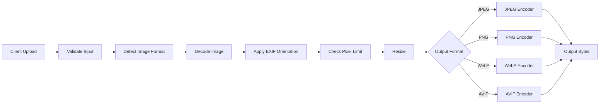

# Image Resizer

A safe, lightweight Python image-resizing utility with support for modern image formats.

The project performs **aspect-ratio-preserving image resizing** and supports conventional formats such as JPEG and PNG as well as next-generation formats including **WebP** and **AVIF**.

It can also decode **HEIC/HEIF images**, making it suitable for processing photos uploaded directly from modern iPhones and other mobile devices.

## Features

* Resize images while preserving their original aspect ratio
* JPEG output
* PNG output
* WebP output
* AVIF output
* HEIC/HEIF input support
* Configurable output quality
* EXIF orientation correction
* High-quality LANCZOS resizing
* Maximum dimension validation
* Maximum image pixel protection
* Invalid/corrupted image detection
* Image codec availability checks
* Safe handling of uploaded image data
* CLI interface
* Python API
* Docker support
* Automated tests with pytest
* Ruff linting
* No external image-processing service required

## Supported Formats

### Input

The application uses Pillow for image detection and decoding.

Common supported input formats include:

| Format     | Support |
| ---------- | ------- |
| JPEG / JPG | ✅       |
| PNG        | ✅       |
| WebP       | ✅       |
| AVIF       | ✅       |
| HEIC       | ✅       |
| HEIF       | ✅       |
| GIF        | ✅ Input |
| BMP        | ✅ Input |
| TIFF       | ✅ Input |

HEIC and HEIF support is provided through `pillow-heif`.

The application does not trust the uploaded filename or MIME type to determine the actual image format. The image data itself is inspected by the decoder.

### Output

The application currently supports:

| Format | Example      |
| ------ | ------------ |
| JPEG   | `photo.jpg`  |
| PNG    | `photo.png`  |
| WebP   | `photo.webp` |
| AVIF   | `photo.avif` |

WebP and AVIF are useful when smaller file sizes and modern browser delivery are important.

---

## Technology Stack

* Python 3.12+
* Pillow
* pillow-heif
* pytest
* Ruff
* uv
* Docker

---

## Project Structure

```text
image-resizer/
├── src/
│   └── app/
│       ├── __init__.py
│       ├── __main__.py
│       └── core.py
├── tests/
│   └── test_core.py
├── .github/
│   └── workflows/
├── Dockerfile
├── pyproject.toml
├── uv.lock
├── README.md
└── LICENSE
```

---

## Prerequisites

You need:

* Python 3.12 or later
* `uv` recommended for dependency management
* Docker optional

Verify Python:

```bash
python --version
```

Install `uv` if required:

```bash
pip install uv
```

---

## Getting Started

Clone the repository:

```bash
git clone https://github.com/PAUL24/image-resizer.git
cd image-resizer
```

Install the project and development dependencies:

```bash
uv sync --extra dev
```

Check the CLI:

```bash
uv run python -m app --help
```

---

# CLI Usage

The general command format is:

```bash
uv run python -m app INPUT OUTPUT [OPTIONS]
```

Example:

```bash
uv run python -m app photo.jpg resized.webp \
  --width 1200 \
  --height 900 \
  --quality 80
```

The image is resized to fit inside the requested dimensions while maintaining its original aspect ratio.

For example, resizing a:

```text
2000 × 1000
```

image into:

```text
500 × 500
```

produces:

```text
500 × 250
```

instead of stretching the image.

---

# WebP Output

Convert a JPEG into WebP:

```bash
uv run python -m app \
  photo.jpg \
  photo.webp \
  --width 1200 \
  --height 900 \
  --quality 80
```

WebP provides good compression while maintaining high visual quality.

---

# AVIF Output

Convert an image into AVIF:

```bash
uv run python -m app \
  photo.png \
  photo.avif \
  --width 1920 \
  --height 1080 \
  --quality 75
```

AVIF can provide significantly smaller images than traditional JPEG or PNG for many types of content.

AVIF encoding can take longer than JPEG or WebP because of the additional compression work involved.

---

# HEIC / HEIF Input

Photos captured by modern Apple devices are often stored in HEIC format.

The application can read HEIC/HEIF images directly.

### HEIC → WebP

```bash
uv run python -m app \
  IMG_1234.HEIC \
  IMG_1234.webp \
  --width 1600 \
  --height 1600 \
  --quality 80
```

### HEIC → AVIF

```bash
uv run python -m app \
  IMG_1234.HEIC \
  IMG_1234.avif \
  --width 1600 \
  --height 1600 \
  --quality 75
```

### HEIC → JPEG

```bash
uv run python -m app \
  IMG_1234.HEIC \
  IMG_1234.jpg \
  --width 1200 \
  --height 1200 \
  --quality 85
```

### HEIF → PNG

```bash
uv run python -m app \
  photo.heif \
  photo.png \
  --width 1024 \
  --height 1024
```

---

# Output Quality

JPEG, WebP, and AVIF output support configurable quality.

Example:

```bash
--quality 80
```

Quality must be between:

```text
0–100
```

Typical recommended values are:

| Format | Suggested Quality |
| ------ | ----------------: |
| JPEG   |             80–90 |
| WebP   |             75–85 |
| AVIF   |             65–80 |

The exact optimal value depends on the source image and intended use.

---

# Python API

The image resizer can also be used directly from Python.

## Basic Example

```python
from pathlib import Path

from app.core import resize


source = Path("photo.jpg").read_bytes()

result, size = resize(
    source,
    width=1200,
    height=1200,
    output="WEBP",
    quality=80,
)

Path("photo.webp").write_bytes(result)

print(f"Output dimensions: {size}")
```

Example output:

```text
Output dimensions: (1200, 800)
```

---

## HEIC → AVIF from Python

```python
from pathlib import Path

from app.core import resize


source = Path("IMG_1234.HEIC").read_bytes()

result, size = resize(
    source,
    width=1600,
    height=1600,
    output="AVIF",
    quality=75,
)

Path("IMG_1234.avif").write_bytes(result)

print(size)
```

---

## PNG Output

```python
result, size = resize(
    image_bytes,
    width=800,
    height=600,
    output="PNG",
)
```

---

## JPEG Output

```python
result, size = resize(
    image_bytes,
    width=800,
    height=600,
    output="JPEG",
    quality=85,
)
```

`JPG` can also be normalized to JPEG when supported by the application.

---

## WebP Output

```python
result, size = resize(
    image_bytes,
    width=1200,
    height=900,
    output="WEBP",
    quality=80,
)
```

---

## AVIF Output

```python
result, size = resize(
    image_bytes,
    width=1200,
    height=900,
    output="AVIF",
    quality=75,
)
```

---

# Processing Uploaded Files

The application also provides `process_upload()` for integration with HTTP APIs, serverless functions, or other upload handlers.

Example:

```python
from app.core import process_upload


result = process_upload(
    data=file_bytes,
    filename="IMG_4567.HEIC",
    content_type="image/heic",
    output="WEBP",
    width=1024,
    height=1024,
    quality=80,
)
```

For AVIF:

```python
result = process_upload(
    data=file_bytes,
    filename="IMG_4567.HEIC",
    content_type="image/heic",
    output="AVIF",
    width=1024,
    height=1024,
    quality=75,
)
```

The application detects the real image format from the uploaded bytes rather than blindly trusting:

```text
filename
Content-Type
```

This helps prevent incorrectly labelled files from bypassing image validation.

---

# Image Orientation

Mobile photos frequently contain EXIF orientation metadata.

The resizer automatically applies EXIF orientation before resizing so that portrait images captured on phones are not accidentally returned rotated or upside down.

---

# Safety and Validation

Image processing can consume significant memory and CPU, especially when handling untrusted uploads.

The application contains several safeguards.

## Dimension Limit

Requested output dimensions must be between:

```text
1 × 1
```

and:

```text
4096 × 4096
```

Invalid dimensions produce:

```text
dimensions out of range
```

---

## Input Pixel Limit

The application rejects images containing more than:

```text
25,000,000 pixels
```

This helps protect against extremely large or malicious images.

Example:

```text
image pixel limit exceeded
```

---

## Invalid Images

Corrupted or unsupported image data produces:

```text
invalid or unsupported image
```

---

## Empty Upload

Empty image data produces:

```text
image data is empty
```

---

## Invalid Output Format

Only these output formats are supported:

```text
PNG
JPEG
WEBP
AVIF
```

Requesting another format produces an error similar to:

```text
output must be PNG, JPEG, WEBP, or AVIF
```

---

## Invalid Quality

Quality values outside the valid range are rejected.

For example:

```python
resize(
    image_bytes,
    800,
    800,
    "WEBP",
    quality=150,
)
```

produces:

```text
quality must be between 0 and 100
```

---

# Codec Availability

WebP and AVIF support depends on the codecs available in the installed Pillow build.

The application checks codec availability before attempting to encode the image.

Possible errors include:

```text
WEBP encoding is not available in this Pillow build
```

or:

```text
AVIF encoding is not available in this Pillow build
```

When installing the standard supported Pillow wheels, these codecs are normally available.

---

# Error Handling

Application-level image processing errors derive from:

```python
ImageResizerError
```

which itself derives from `ValueError`.

Example:

```python
from app.core import ImageResizerError, resize


try:
    result, size = resize(
        image_bytes,
        width=1000,
        height=1000,
        output="AVIF",
        quality=75,
    )

except ImageResizerError as exc:
    print(f"Unable to resize image: {exc}")
```

Typical errors include:

```text
dimensions out of range
quality must be between 0 and 100
image data is empty
image pixel limit exceeded
invalid or unsupported image
output must be PNG, JPEG, WEBP, or AVIF
WEBP encoding is not available in this Pillow build
AVIF encoding is not available in this Pillow build
failed to encode WEBP
failed to encode AVIF
```

---

# Running Tests

Run the complete test suite:

```bash
uv run pytest
```

Run with verbose output:

```bash
uv run pytest -v
```

The tests cover functionality including:

* Aspect-ratio preservation
* PNG output
* JPEG output
* WebP output
* AVIF output
* HEIC/HEIF decoding
* Invalid image bytes
* Invalid dimensions
* Invalid output formats
* Invalid quality values

---

# Code Quality

Run Ruff:

```bash
uv run ruff check .
```

Automatically fix supported lint problems:

```bash
uv run ruff check . --fix
```

Run both validation steps before committing:

```bash
uv run ruff check .
uv run pytest
```

---

# Docker

Build the image:

```bash
docker build -t image-resizer:local .
```

Check the command:

```bash
docker run --rm image-resizer:local --help
```

Process a local image by mounting the current directory:

```bash
docker run --rm \
  -v "$(pwd):/images" \
  image-resizer:local \
  /images/photo.jpg \
  /images/photo.webp \
  --width 1200 \
  --height 900 \
  --quality 80
```

HEIC example:

```bash
docker run --rm \
  -v "$(pwd):/images" \
  image-resizer:local \
  /images/IMG_1234.HEIC \
  /images/IMG_1234.avif \
  --width 1600 \
  --height 1600 \
  --quality 75
```

---

# Development Workflow

Create a development branch:

```bash
git checkout -b feature/next-gen-image-formats
```

Install dependencies:

```bash
uv sync --extra dev
```

Run validation:

```bash
uv run ruff check .
uv run pytest
```

Commit the changes:

```bash
git add .
git commit -m "feat: add WebP AVIF and HEIC/HEIF support"
```

Push the branch:

```bash
git push -u origin feature/next-gen-image-formats
```

---

# Why WebP and AVIF?

Traditional formats such as JPEG and PNG remain widely supported, but modern applications often benefit from newer formats.

## WebP

WebP offers:

* Good lossy compression
* Lossless compression
* Alpha transparency
* Excellent browser compatibility
* Frequently smaller files than JPEG and PNG

It is a strong general-purpose format for web applications.

## AVIF

AVIF offers:

* Very efficient compression
* High image quality at smaller file sizes
* Transparency
* Modern browser support

AVIF is especially useful when bandwidth and storage reduction are priorities.

Encoding AVIF generally requires more CPU time than JPEG or WebP.

---

# Why HEIC / HEIF Support?

Many smartphones, particularly Apple devices, capture photographs using HEIC.

Without HEIC support, applications commonly reject perfectly valid images uploaded directly from users' phones.

Using `pillow-heif`, this project can decode HEIC/HEIF images and convert them into web-friendly formats such as:

```text
HEIC → JPEG
HEIC → PNG
HEIC → WebP
HEIC → AVIF
```

This makes the resizer more suitable for:

* Profile photo uploads
* E-commerce product images
* CMS platforms
* Social applications
* Mobile applications
* Image optimization pipelines
* Serverless image-processing services

---

# Production Considerations

For production deployments, consider adding:

* Maximum uploaded file-size enforcement
* Request timeouts
* API authentication
* Rate limiting
* Structured logging
* Distributed tracing
* Malware scanning where appropriate
* Object storage integration
* Asynchronous processing for very large workloads
* Resource and memory limits
* Metrics for processing duration and failures
* CDN integration
* Automatic format selection based on client capabilities

For public HTTP endpoints, file-size limits should ideally be enforced before the complete upload is loaded into application memory.

---

# Example Processing Pipeline



HEIC and HEIF images enter through the same processing pipeline once `pillow-heif` registers its Pillow decoder.

---

# License

This project is licensed under the MIT License.

See [`LICENSE`](LICENSE) for details.
