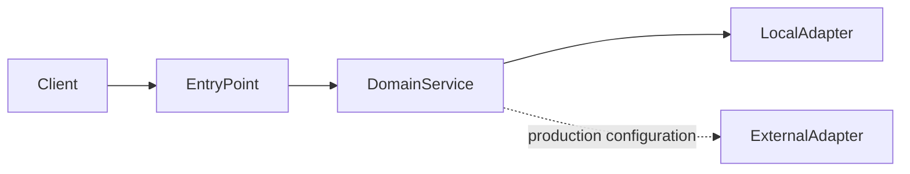

# Image Resizer

Safe aspect-preserving JPEG and PNG thumbnail generation.

## Features

- A working domain flow focused on this repository's engineering concept
- Deterministic local adapters and fixtures; no paid service or credential is required
- Validation, negative-path tests, container packaging, and continuous integration

## Architecture



## Technology Stack

Python 3.12, FastAPI/Pydantic where HTTP is exposed, pytest, ruff

## Project Structure

- `src/` application and domain code
- `tests/` focused unit and integration tests
- `.github/workflows/ci.yml` reproducible CI checks
- `examples/` safe sample input where useful

## Prerequisites

Python 3.12+ and uv (recommended); Docker is optional.

## Getting Started

Clone the repository, copy `.env.example` to `.env` if configuration is needed, then use the commands below.

## Environment Variables

`.env.example` is the complete safe template. Secrets are read at runtime and must never be committed.

## Running Locally


```bash
uv sync --extra dev
uv run python -m app --help
```


## API / Usage Examples

```bash
python -m app --help
```


## Running Tests

Run `uv run ruff check .` and `uv run pytest`.

## Docker

```bash
docker build -t b02-image-resizer:local .
docker run --rm -p 8000:8000 b02-image-resizer:local
```

## Security Considerations

Inputs are bounded and validated, development adapters avoid live credentials, and logs must not contain secrets.

## Possible Production Improvements

Add managed persistence, distributed tracing, service-specific authorization, rate limiting, a production external-service adapter, and deployment policy checks.

## License

MIT; see `LICENSE`.
